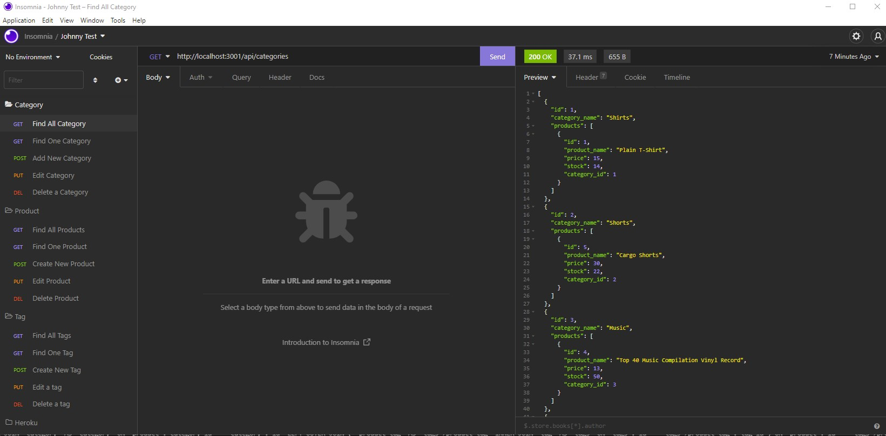

# E Store Back End

## Table of Contents

- [Installation](#installation)
- [Usage](#usage)
- [Questions](#questions)

## Description

This is a back end database that has multiple models that we link to eachother for a fictional E-Commerce website. When you go into insomnia you can create, update, delete and view information in the Category, Products and Tags model's.

## Installation

Go into your root directory and type npm init and then npm install. Afterwards make a .env file in the root directory that contains DB_NAME='ecommerce_db', DB_USER='<your-sequelize-username-here>' and DB_PW='<your-seuqelize-password-here>'. Now make sure line 15 in server.js is set to true and then type npm start in your terminal making sure you are still in the root directory. After that hit ctrl+C to close npm and go back to line 15 in server.js and set it back to false. Finally type npm run seed in your terminal and you will be fully installed.

## Usage

then type npm start and you should be good to go. Now just jump into insomnia and test the routes.

To use this program simply type npm start in the root directory and everything will run. From there you will open insomnia to start testing the routes. Here is a <a href="https://drive.google.com/file/d/1hx9aRA3x9uk6VG6oqQYigxXu-UgtagEY/view">video of E Store Back End in action.</a>

## Questions

<a href="https://github.com/JohnKnee3">JohnKnee3's GitHub</a>

If you want to contact me please send me an email at john.a.clark3@yahoo.com and I will get back to you as soon as possible.
